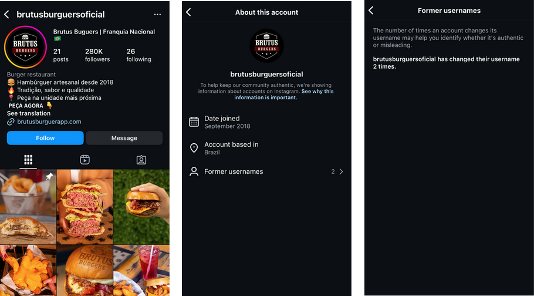
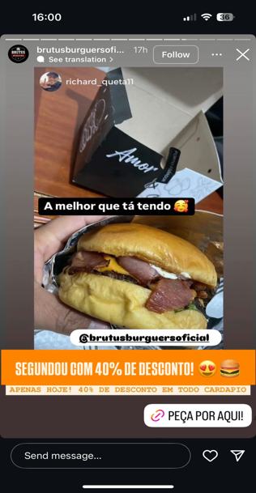
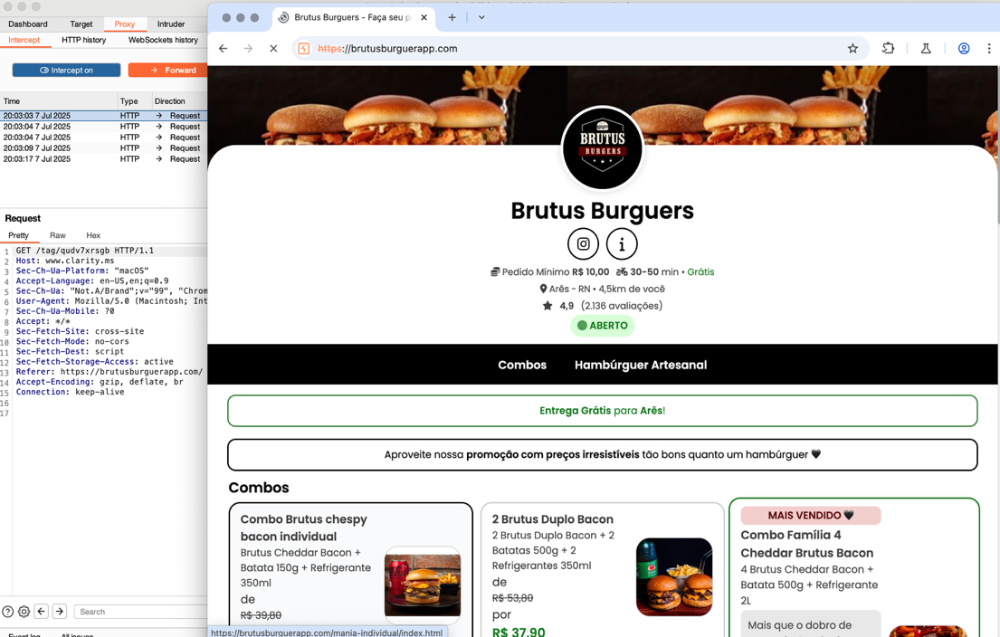
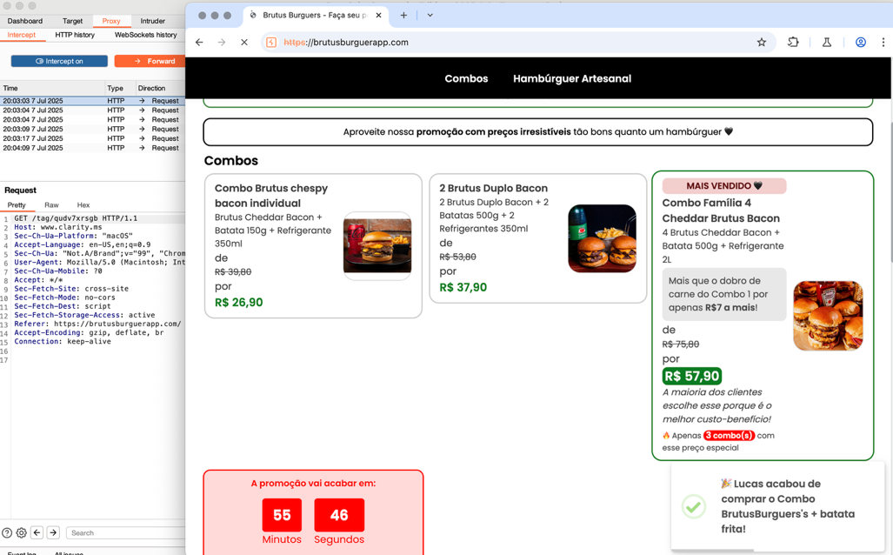
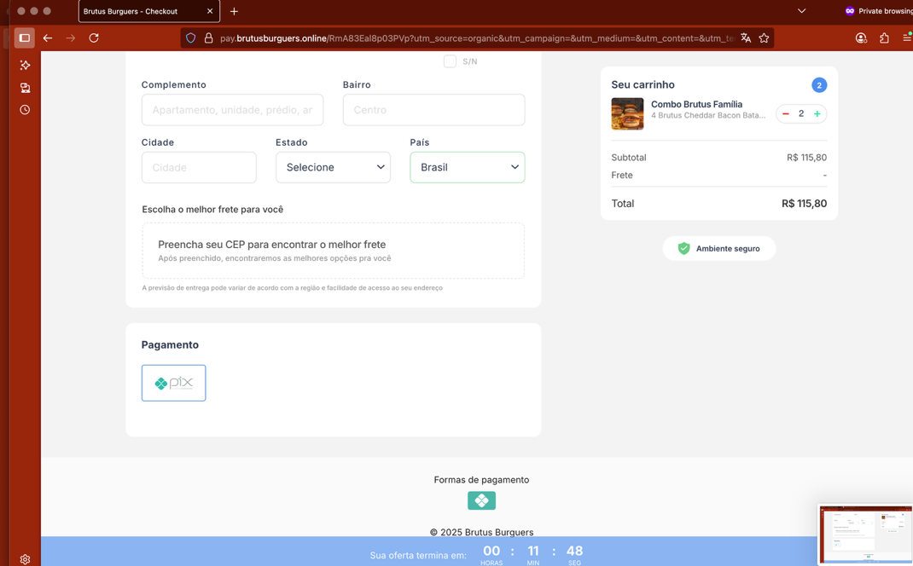
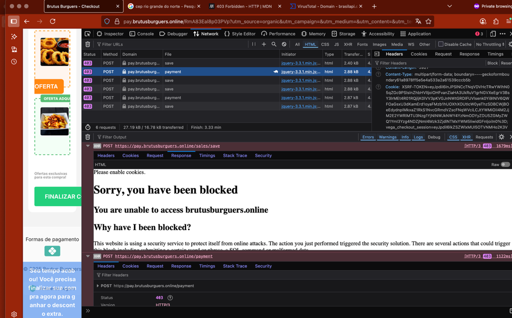

# Methodology — Fake Food Delivery Scam

## Discovery

Search performed on **X (Twitter)** using the following advanced query with a disposable account:

```
golpe (phishing OR whatsapp OR boleto OR pix)
(#golpewhatsapp OR #golpereceita OR #golpetelefone OR #golpeboleto OR #golpepix)
lang:pt
since:2025-06-25
```

| Term | Purpose |
|------|---------|
| `golpe` | Primary keyword ("scam" in Portuguese) |
| `phishing OR whatsapp OR boleto OR pix` | Related attack vectors (OR = any may appear) |
| Hashtags | Community-tagged scam reports |
| `lang:pt` | Portuguese language filter |
| `since:2025-06-25` | Date limit |

A post with **50+ comments** caught attention — users reporting the same fake burger franchise scam. From there, the Instagram profile was located and the investigation began.

---

## Investigation Steps

### 1. Instagram Profile Analysis
- Follower count vs. post count ratio
- Post publication dates and patterns
- Comment availability and dates
- Username change history
- Visual content inconsistencies

**Profile overview — 280K followers, 21 posts, 2 username changes, joined Sept 2019:**



**Sponsored story — entry point for victims:**



### 2. Domain Resolution
```bash
nslookup brutusburguerapp.com
# Returns: 34.174.128.95
```

### 3. IP Enrichment (custom Python script)
```bash
python vt-script.py 34.174.128.95
# Queries VirusTotal API for:
# - Reputation score
# - JARM fingerprint
# - WHOIS data
# - Analysis stats
# - Community votes
```

### 4. Request Interception
- Burp Suite configured as proxy
- Attempted to capture PIX QR code generation request
- **Blocked by WAF** (both proxy and VPN connections)

**Order site intercepted via Burp Suite (partial — blocked before PIX step):**



**Urgency tactics observed on the landing page:**



**Checkout page showing PIX-only payment and address collection:**



**WAF block — triggered on Burp Suite proxy connection:**



### 5. Related Domain Batch Analysis
```bash
python nslookup-script.py domains.txt
# Batch resolves all identified related domains
# Outputs IP list for VirusTotal batch enrichment
```

### 6. Framework Mapping
- MITRE ATT&CK
- Diamond Model
- Cyber Kill Chain

---

## Limitations

- WAF blocked dynamic analysis of the PIX generation endpoint
- PIX QR code payload could not be captured
- Attacker identity not determined

## Next Steps (Recommended)

- WAF bypass attempt via Burp Suite with custom headers
- Isolated VM analysis to capture PIX endpoint behavior
- Automated monitoring for new profiles using the same template
- Domain registrar takedown requests for all identified domains
